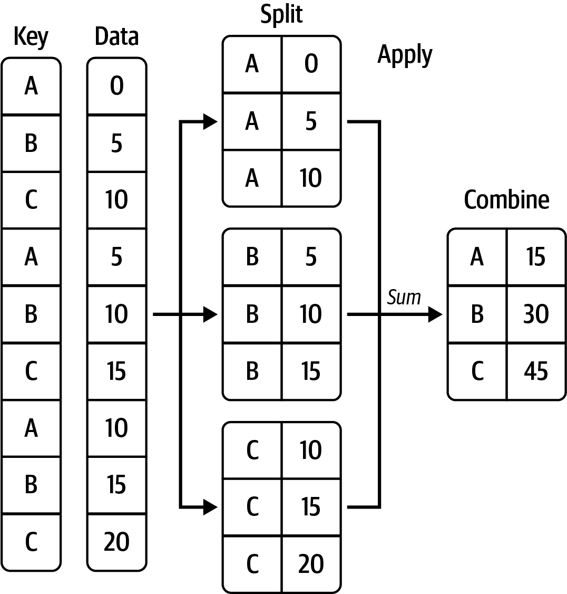

# Data Grouping and Aggregation

In this lecture, you'll learn how to:
- Use hierarchical (multi-level) indexing for advanced data selection and reshaping
- Combine and merge datasets using pandas
- Concatenate data along different axes
- Perform group-based operations and aggregations (split–apply–combine)
- Create pivot tables for summarizing data

Grouping and aggregation are essential for data wrangling, reporting, and analysis in pandas.

---

## Why Grouping and Aggregation?

Grouping and aggregation allow us to:

* Split datasets into meaningful groups,
* Apply built-in or custom functions to each group,
* Combine the results into a concise summary.


This is often referred to as the **split–apply–combine** framework, and it is one of the most powerful features of pandas.

> **Motivation:**
> Imagine you want to compute the average tip by day and smoker status in a restaurant dataset. Grouping and aggregation make this easy and efficient.

Before we move to real-world data (restaurant tipping dataset), we will first study:

* Hierarchical indexing,
* Combining and merging datasets,
* Concatenating along an axis,
* Group operations on synthetic datasets.


Later, we will introduce the restaurant tipping dataset and use it to demonstrate column-wise and multiple function aggregations, pivot tables, and cross-tabulations.

---

## Hierarchical Indexing


### What is Hierarchical Indexing?

One of the most important features of pandas is **hierarchical indexing** (also known as **MultiIndexing**).
It enables you to have multiple index levels on an axis.

You can think of hierarchical indexing as a way to:

* Organize data in higher dimensions while still using familiar pandas objects,
* Perform complex data selections (e.g., select by row group and sub-group),
* Reshape data efficiently for reporting or pivot tables.


We will start with some simple examples using Series and then move to DataFrames.

---

### Series with a MultiIndex


We can create a `Series` with multiple levels of indexing by passing a list of lists (or arrays) as the index:

```python
import numpy as np
import pandas as pd

data = pd.Series(np.random.uniform(size=9),
                 index=[["a", "a", "a", "b", "b", "c", "c", "d", "d"],
                        [1, 2, 3, 1, 3, 1, 2, 2, 3]])
print(data)

# a  1    0.714879
#    2    0.930025
#    3    0.371543
# b  1    0.889417
#    3    0.179524
# c  1    0.940936
#    2    0.812441
# d  2    0.711971
#    3    0.861086
# dtype: float64
```

> **Try it yourself:**
> Create a Series with three levels of indexing. Select all values for one outer group and one inner group.

Notice how the index is shown in a two-level structure. The “gaps” in the index display mean “use the label directly above.”

We can confirm this by checking the index object:

```python
print(data.index)

# MultiIndex([('a', 1),
#             ('a', 2),
#             ('a', 3),
#             ('b', 1),
#             ('b', 3),
#             ('c', 1),
#             ('c', 2),
#             ('d', 2),
#             ('d', 3)],
#            )
```

---

### Partial Indexing and Selection

With hierarchical indexing, **partial indexing** is possible. This allows us to concisely select subsets of the data.

For example, select all data for group `"b"`:

```python
print(data["b"])

# 1    0.889417
# 3    0.179524
# dtype: float64
```

Or select from `"b"` through `"c"`:

```python
print(data["b":"c"])
# b  1    0.889417
#    3    0.179524
# c  1    0.940936
#    2    0.812441
# dtype: float64
```

You can also select multiple outer labels at once:

```python
print(data[["b", "d"]])
# b  1    0.889417
#    3    0.179524
# d  2    0.711971
#    3    0.861086
# dtype: float64
```

---

### Selecting Inner-Level Values

Selection can also happen on the **inner level** of the index.

For example, select all values where the second index equals `2`:

```python
print(data.loc[:, 2])

# a    0.930025
# c    0.812441
# d    0.711971
# dtype: float64
```

Or select a **range of values** from the second level:

```python
print(data.loc[:, 2:3])

# a  2    0.930025
#    3    0.371543
# b  3    0.179524
# c  2    0.812441
# d  2    0.711971
#    3    0.861086
# dtype: float64
```

Or select **specific values** from the second level (e.g., 1 and 3):

```python
print(data.loc[:, [1,3]])

# a  1    0.714879
#    3    0.371543
# b  1    0.889417
#    3    0.179524
# c  1    0.940936
# d  3    0.861086
# dtype: float64
```

---

### Reshaping with `unstack` and `stack`

Hierarchical indexing is closely tied to **reshaping operations** in pandas.

* `unstack()` pivots the **inner level** of the row index into columns.
* `stack()` does the inverse, pivoting columns back into a row index.

```python
print(data.unstack())

#           1         2         3
# a  0.714879  0.930025  0.371543
# b  0.889417       NaN  0.179524
# c  0.940936  0.812441       NaN
# d       NaN  0.711971  0.861086
```

Now reverse the operation:

```python
print(data.unstack().stack())

# a  1    0.714879
#    2    0.930025
#    3    0.371543
# b  1    0.889417
#    3    0.179524
# c  1    0.940936
#    2    0.812441
# d  2    0.711971
#    3    0.861086
# dtype: float64
```

---

### Hierarchical Index in a DataFrame

Hierarchical indexing is not limited to Series — both rows and columns of a DataFrame can have multiple levels.

Let’s create a DataFrame with a MultiIndex on both rows and columns:

```python
frame = pd.DataFrame(np.arange(12).reshape((4, 3)),
                     index=[["a", "a", "b", "b"], [1, 2, 1, 2]],
                     columns=[["Ohio", "Ohio", "Colorado"],
                              ["Green", "Red", "Green"]])
print(frame)

#      Ohio     Colorado
#     Green Red    Green
# a 1     0   1        2
#   2     3   4        5
# b 1     6   7        8
#   2     9  10       11
```

We can assign **names** to each level of the index for clarity:

```python
frame.index.names = ["key1", "key2"]
frame.columns.names = ["state", "color"]

print(frame)

# state      Ohio     Colorado
# color     Green Red    Green
# key1 key2                   
# a    1        0   1        2
#      2        3   4        5
# b    1        6   7        8
#      2        9  10       11
```

---

### Selecting Subsets with Partial Column Indexing

Partial indexing also works for columns when using a MultiIndex.

```python
print(frame["Ohio"])

#      Green  Red
# a 1      0    1
#   2      3    4
# b 1      6    7
#   2      9   10
```

We can go deeper by selecting a single sub-column and slicing rows:

```python
print(frame["Ohio"]["Green"].loc["a":"b",1])

# a  1    0
# b  1    6
# Name: Green, dtype: int64
```

Another example with `"Colorado"`:

```python
print(frame["Colorado"]["Green"].loc["b",1:2])

# b  1     8
#    2    11
# Name: Green, dtype: int64
```

---

**Summary:**

* Hierarchical indexing (MultiIndex) lets you represent higher-dimensional data compactly.
* It enables flexible and powerful selection operations.
* It is central to reshaping operations like `stack` and `unstack`.
* Both Series and DataFrames can use multiple levels of indexing on rows and/or columns.

## Combining and Merging Datasets

In many data analysis tasks, we need to bring together data from different sources. Pandas provides flexible tools for:

1. **Merging (joining)** datasets by linking rows using one or more keys.
2. **Concatenating** datasets along rows or columns.

These operations are particularly important when working with relational-style data, where tables are related through common keys.

### Merge (Join) Operations

The `pandas.merge` function is the main entry point for joining datasets.

#### Example: Many-to-One Join

```python
df1 = pd.DataFrame({"key": ["b", "b", "a", "c", "a", "a", "b"],
                    "data1": pd.Series(range(7), dtype="Int64")})
df2 = pd.DataFrame({"key": ["a", "b", "d"],
                    "data2": pd.Series(range(3), dtype="Int64")})

print(df1)

#   key  data1
# 0   b      0
# 1   b      1
# 2   a      2
# 3   c      3
# 4   a      4
# 5   a      5
# 6   b      6

print(df2)

#   key  data2
# 0   a      0
# 1   b      1
# 2   d      2
```

This is a **many-to-one join**: `df1` has multiple rows with `"a"` and `"b"`, while `df2` has only one row per key.

```python
print(pd.merge(df1, df2))

#   key  data1  data2
# 0   b      0      1
# 1   b      1      1
# 2   b      6      1
# 3   a      2      0
# 4   a      4      0
# 5   a      5      0
```

By default, `merge` uses the overlapping column names as the join keys. It is good practice to **explicitly specify the join key**:

```python
print(pd.merge(df1, df2, on="key"))

#   key  data1  data2
# 0   b      0      1
# 1   b      1      1
# 2   b      6      1
# 3   a      2      0
# 4   a      4      0
# 5   a      5      0
```

#### Joining on Different Column Names

If the join key columns have different names, we can specify them separately:

```python
df3 = pd.DataFrame({"lkey": ["b", "b", "a", "c", "a", "a", "b"],
                    "data1": pd.Series(range(7), dtype="Int64")})
df4 = pd.DataFrame({"rkey": ["a", "b", "d"],
                    "data2": pd.Series(range(3), dtype="Int64")})

print(pd.merge(df3, df4, left_on="lkey", right_on="rkey"))

#   lkey  data1 rkey  data2
# 0    b      0    b      1
# 1    b      1    b      1
# 2    b      6    b      1
# 3    a      2    a      0
# 4    a      4    a      0
# 5    a      5    a      0
```

You may notice that the `"c"` and `"d"` values and associated data are missing from the result. By default, `pandas.merge` does an `"inner"` join; the keys in the result are the intersection, or the common set found in both tables.

#### Different Types of Joins

We can specify the type of join with the `how` argument. Options are:

* `"inner"` (default): use only keys that appear in both tables.
* `"left"`: use all keys from the left table.
* `"right"`: use all keys from the right table.
* `"outer"`: use all keys from both tables (union).

Example of an **outer join**:

```python
print(pd.merge(df1, df2, how="outer"))

#   key  data1  data2
# 0   b      0      1
# 1   b      1      1
# 2   b      6      1
# 3   a      2      0
# 4   a      4      0
# 5   a      5      0
# 6   c      3   <NA>
# 7   d   <NA>      2

print(pd.merge(df3, df4, left_on="lkey", right_on="rkey", how="outer"))

#   lkey  data1 rkey  data2
# 0    b      0    b      1
# 1    b      1    b      1
# 2    b      6    b      1
# 3    a      2    a      0
# 4    a      4    a      0
# 5    a      5    a      0
# 6    c      3  NaN   <NA>
# 7  NaN   <NA>    d      2
```

#### Summary of Join Options

| **Option**    | **Behavior**                                              |
| ------------- | --------------------------------------------------------- |
| `how="inner"` | Use only the key combinations observed in both tables     |
| `how="left"`  | Use all key combinations found in the left table          |
| `how="right"` | Use all key combinations found in the right table         |
| `how="outer"` | Use all key combinations observed in both tables together |

#### `merge` Function Arguments

| **Argument**  | **Description**                                                                                                                                                                                        |
| ------------- | ------------------------------------------------------------------------------------------------------------------------------------------------------------------------------------------------------ |
| `left`        | DataFrame to be merged on the left side.                                                                                                                                                               |
| `right`       | DataFrame to be merged on the right side.                                                                                                                                                              |
| `how`         | Type of join to apply: one of `"inner"`, `"outer"`, `"left"`, or `"right"`; defaults to `"inner"`.                                                                                                     |
| `on`          | Column names to join on. Must be found in both DataFrame objects. If not specified and no other join keys given, will use the intersection of the column names in `left` and `right` as the join keys. |
| `left_on`     | Columns in `left` DataFrame to use as join keys. Can be a single column name or a list of column names.                                                                                                |
| `right_on`    | Analogous to `left_on` for `right` DataFrame.                                                                                                                                                          |
| `left_index`  | Use row index in `left` as its join key (or keys, if a `MultiIndex`).                                                                                                                                  |
| `right_index` | Analogous to `left_index`.                                                                                                                                                                             |
| `sort`        | Sort merged data lexicographically by join keys; `False` by default.                                                                                                                                   |
| `suffixes`    | Tuple of string values to append to column names in case of overlap; defaults to `("_x", "_y")` (e.g., if `"data"` in both DataFrame objects, would appear as `"data_x"` and `"data_y"` in result).    |
| `copy`        | If `False`, avoid copying data into resulting data structure in some exceptional cases; by default always copies.                                                                                      |
| `validate`    | Verifies if the merge is of the specified type, whether one-to-one, one-to-many, or many-to-many. See the docstring for full details on the options.                                                   |
| `indicator`   | Adds a special column `_merge` that indicates the source of each row; values will be `"left_only"`, `"right_only"`, or `"both"` based on the origin of the joined data in each row.                    |

---

### Concatenation

Another way to combine datasets is **concatenation**, also known as stacking.
Instead of joining on keys, this stacks pandas objects along a particular axis.

#### Concatenating Along Rows

```python
df1 = pd.DataFrame(np.random.standard_normal((3, 4)),
                   columns=["a", "b", "c", "d"])
df2 = pd.DataFrame(np.random.standard_normal((2, 3)),
                   columns=["b", "d", "a"])

print(df1)

#           a         b         c         d
# 0 -0.146334 -0.568061  1.718937 -0.451207
# 1 -1.134963 -1.201191 -0.599733  0.692181
# 2  0.035097  0.058311 -2.133575 -0.311273

print(df2)

> **Try it yourself:**
> Concatenate two DataFrames with different columns. What happens to the missing values?

#           b         d         a
# 0 -0.503715  0.272574 -0.439464
# 1  0.040769 -0.976459 -0.432724
```

Concatenate row-wise (`axis=0`):

```python
print(pd.concat([df1, df2], axis=0))

#           a         b         c         d
# 0 -0.146334 -0.568061  1.718937 -0.451207
# 1 -1.134963 -1.201191 -0.599733  0.692181
# 2  0.035097  0.058311 -2.133575 -0.311273
# 0 -0.439464 -0.503715       NaN  0.272574
# 1 -0.432724  0.040769       NaN -0.976459
```

Reset the index with `ignore_index=True`:

```python
print(pd.concat([df1, df2], axis=0, ignore_index=True))

#           a         b         c         d
# 0 -0.146334 -0.568061  1.718937 -0.451207
# 1 -1.134963 -1.201191 -0.599733  0.692181
# 2  0.035097  0.058311 -2.133575 -0.311273
# 3 -0.439464 -0.503715       NaN  0.272574
# 4 -0.432724  0.040769       NaN -0.976459
```

Create a hierarchical index using `keys`:

```python
print(pd.concat([df1, df2], axis=0, keys=['df1','df2']))

#               a         b         c         d
# df1 0 -0.146334 -0.568061  1.718937 -0.451207
#     1 -1.134963 -1.201191 -0.599733  0.692181
#     2  0.035097  0.058311 -2.133575 -0.311273
# df2 0 -0.439464 -0.503715       NaN  0.272574
#     1 -0.432724  0.040769       NaN -0.976459
```

#### Concatenating Along Columns

```python
print(pd.concat([df1, df2], axis=1))

#           a         b         c         d         b         d         a
# 0 -0.146334 -0.568061  1.718937 -0.451207 -0.503715  0.272574 -0.439464
# 1 -1.134963 -1.201191 -0.599733  0.692181  0.040769 -0.976459 -0.432724
# 2  0.035097  0.058311 -2.133575 -0.311273       NaN       NaN       NaN
```

Reset the column labels with `ignore_index=True`:

```python
print(pd.concat([df1, df2], axis=1, ignore_index=True))

#           0         1         2         3         4         5         6
# 0 -0.146334 -0.568061  1.718937 -0.451207 -0.503715  0.272574 -0.439464
# 1 -1.134963 -1.201191 -0.599733  0.692181  0.040769 -0.976459 -0.432724
# 2  0.035097  0.058311 -2.133575 -0.311273       NaN       NaN       NaN
```

Assign `keys` to create a **column MultiIndex**:

```python
print(pd.concat([df1, df2], axis=1, keys=['df1','df2']))

#         df1                                     df2                    
#           a         b         c         d         b         d         a
# 0 -0.146334 -0.568061  1.718937 -0.451207 -0.503715  0.272574 -0.439464
# 1 -1.134963 -1.201191 -0.599733  0.692181  0.040769 -0.976459 -0.432724
# 2  0.035097  0.058311 -2.133575 -0.311273       NaN       NaN       NaN
```

#### `concat` Function Arguments

| **Argument**       | **Description**                                                                                                                                                                                                                                   |
| ------------------ | ------------------------------------------------------------------------------------------------------------------------------------------------------------------------------------------------------------------------------------------------- |
| `objs`             | List or dictionary of pandas objects to be concatenated; this is the only required argument                                                                                                                                                       |
| `axis`             | Axis to concatenate along; defaults to concatenating along rows (`axis="index"`)                                                                                                                                                                  |
| `join`             | Either `"inner"` or `"outer"` (`"outer"` by default); whether to intersect (inner) or union (outer) indexes along the other axes                                                                                                                  |
| `keys`             | Values to associate with objects being concatenated, forming a hierarchical index along the concatenation axis; can be a list or array of arbitrary values, an array of tuples, or a list of arrays (if multiple-level arrays passed in `levels`) |
| `levels`           | Specific indexes to use as hierarchical index level or levels if keys passed                                                                                                                                                                      |
| `names`            | Names for created hierarchical levels if `keys` and/or `levels` passed                                                                                                                                                                            |
| `verify_integrity` | Check new axis in concatenated object for duplicates and raise an exception if so; by default (`False`) allows duplicates                                                                                                                         |
| `ignore_index`     | Do not preserve indexes along concatenation `axis`, instead produce a new `range(total_length)` index                                                                                                                                             |

## Data Aggregation and Group Operations

Categorizing a dataset and applying a function to each group—whether an aggregation or a transformation—is a critical component of many analysis workflows. After loading, merging, and preparing a dataset, you often need to compute group statistics or build pivot-like summaries for reporting and visualization. Pandas provides a versatile `groupby` interface that makes it natural to slice, dice, and summarize datasets.

One reason relational databases and SQL are popular is the ease of joining, filtering, transforming, and aggregating data. However, SQL can be limiting for more complex group operations. With Python and pandas, we can express complex behavior as custom functions that operate on each group.

In this section, you will learn to:

* Split a pandas object into pieces using one or more keys (functions, arrays, or DataFrame column names)
* Calculate group summary statistics like count, mean, or standard deviation (or a user-defined function)
* Apply within-group transformations or other manipulations (e.g., normalization, regression, ranking, subset selection)
* Perform quantile analysis and other statistical group analyses

### How to Think About Group Operations

Hadley Wickham popularized the term **split–apply–combine** to describe group operations. First, data in a pandas object (Series, DataFrame, etc.) is **split** into groups based on one or more **keys** you provide. Splitting occurs along a particular axis (rows via `axis="index"` or columns via `axis="columns"`). Next, a function is **applied** to each group to produce a new value. Finally, results from all groups are **combined** into a result object whose form depends on the operation.



Let’s start by importing what we need:

```python
import numpy as np
import pandas as pd
```

We’ll use a small tabular dataset as a DataFrame:

```python
df = pd.DataFrame({"key1" : ["a", "a", None, "b", "b", "a", None],
                   "key2" : pd.Series([1, 2, 1, 2, 1, None, 1],
                                      dtype="Int64"),
                   "data1" : np.random.standard_normal(7),
                   "data2" : np.random.standard_normal(7)})
print(df)

#    key1  key2     data1     data2
# 0     a     1  0.300663  1.981047
# 1     a     2  1.367287  1.240606
# 2  None     1 -1.414299  0.323409
# 3     b     2 -1.646634 -0.520176
# 4     b     1 -0.215571  1.135378
# 5     a  <NA>  0.294897  0.210316
# 6  None     1 -0.397104 -0.864798

---

---

## Summary

- Hierarchical indexing enables powerful data selection and reshaping.
- Merging and concatenation are essential for combining datasets.
- The groupby interface implements the split–apply–combine paradigm for flexible aggregation.
- Pivot tables and crosstabs provide concise data summaries.

## Further Reading

- [Pandas User Guide: MultiIndex / Advanced Indexing](https://pandas.pydata.org/pandas-docs/stable/user_guide/advanced.html)
- [Python for Data Analysis, 3rd Edition](https://wesmckinney.com/book/)

```

Suppose we split by `key1` using `groupby`:

```python
grouped = df.groupby("key1")

print(grouped)

# <pandas.core.groupby.generic.DataFrameGroupBy object at 0x7b6ef2387fa0>
```

This `grouped` object hasn’t computed anything yet; it just stores grouping metadata. To compute group means:

```python
print(grouped.mean(numeric_only=True))
# print(df.groupby("key1").mean(numeric_only=True))

#       key2     data1     data2
# key1                          
# a      1.5 -0.444136  0.255950
# b      1.5  0.202216 -1.779516

print(df.groupby("key2").mean(numeric_only=True))

#          data1     data2
# key2                    
# 1    -0.431578  0.643759
# 2    -0.139673  0.360215
```

Grouping by multiple arrays (two keys) yields a hierarchical index of observed key pairs:

```python
print(df.groupby(["key1", "key2"]).mean(numeric_only=True))

#               data1     data2
# key1 key2                    
# a    1     0.300663  1.981047
#      2     1.367287  1.240606
# b    1    -0.215571  1.135378
#      2    -1.646634 -0.520176
```

A very useful method is `size`, which returns a Series of group sizes:

```python
print(df.groupby(["key1", "key2"]).size())

# key1  key2
# a     1       1
#       2       1
# b     1       1
#       2       1
# dtype: int64
```

By default, groups with missing values in the keys are **excluded**. Disable this by using `dropna=False`:

```python
print(df.groupby("key1").size())

# key1
# a    3
# b    2
# dtype: int64

print(df.groupby("key1", dropna=False).size())

# key1
# a      3
# b      2
# NaN    2
# dtype: int64

print(df.groupby(["key1", "key2"]).size())

# key1  key2
# a     1       1
#       2       1
# b     1       1
#       2       1
# dtype: int64

print(df.groupby(["key1", "key2"], dropna=False).size())

# key1  key2
# a     1       1
#       2       1
#       <NA>    1
# b     1       1
#       2       1
# NaN   1       2
# dtype: int64
```

A related method is `count`, which counts **non-null** values per column in each group:

```python
print(df.groupby("key1").count())

#       key2  data1  data2
# key1                    
# a        2      3      3
# b        2      2      2
```

### Iterating over Groups

`groupby` objects support iteration, yielding `(group_name, group_dataframe)`:

```python
for name, group in df.groupby("key1"):
    print(name)
    print(group)

# a
#   key1  key2     data1     data2
# 0    a     1  0.300663  1.981047
# 1    a     2  1.367287  1.240606
# 5    a  <NA>  0.294897  0.210316
# b
#   key1  key2     data1     data2
# 3    b     2 -1.646634 -0.520176
# 4    b     1 -0.215571  1.135378
```

With multiple keys, the group name is a tuple:

```python
for (k1, k2), group in df.groupby(["key1", "key2"]):
    print((k1, k2))
    print(group)

# ('a', 1)
#   key1  key2     data1     data2
# 0    a     1  0.300663  1.981047
# ('a', 2)
#   key1  key2     data1     data2
# 1    a     2  1.367287  1.240606
# ('b', 1)
#   key1  key2     data1     data2
# 4    b     1 -0.215571  1.135378
# ('b', 2)
#   key1  key2     data1     data2
# 3    b     2 -1.646634 -0.520176
```

A handy recipe: build a dictionary of groups in one line:

```python
pieces = {name: group for name, group in df.groupby("key1")}

print(pieces)

# {'a':   key1  key2     data1     data2
# 0    a     1  0.300663  1.981047
# 1    a     2  1.367287  1.240606
# 5    a  <NA>  0.294897  0.210316, 'b':   key1  key2     data1     data2
# 3    b     2 -1.646634 -0.520176
# 4    b     1 -0.215571  1.135378}

print(pieces["b"])

#   key1  key2     data1     data2
# 3    b     2 -1.646634 -0.520176
# 4    b     1 -0.215571  1.135378
```

### Selecting a Column or Subset of Columns

Indexing a `GroupBy` created from a DataFrame with a column name (or list of names) performs column subsetting for aggregation:

```python
df.groupby("key1")["data1"]
df.groupby("key1")[["data2"]]
```

These are equivalent to:

```python
df["data1"].groupby(df["key1"])
df[["data2"]].groupby(df["key1"])
```

To aggregate only a subset, e.g., compute the mean of `data2` for each `(key1, key2)`:

```python
print(df.groupby(["key1", "key2"])["data2"].mean())

# key1  key2
# a     1       1.981047
#       2       1.240606
# b     1       1.135378
#       2      -0.520176
# Name: data2, dtype: float64

print(df.groupby(["key1", "key2"])[["data2"]].mean())

#               data2
# key1 key2          
# a    1     1.981047
#      2     1.240606
# b    1     1.135378
#      2    -0.520176
```

## Data Aggregation

**Aggregations** are transformations that produce scalar values from arrays. We’ve used several already (`mean`, `count`, `min`, `sum`). Many common aggregations have optimized implementations, but you’re not limited to them.

Common aggregation functions include:

| **Function name** | **Description**                                                             |
| ----------------- | --------------------------------------------------------------------------- |
| `any, all`        | Return `True` if any (one or more values) or all non-NA values are “truthy” |
| `count`           | Number of non-NA values                                                     |
| `cummin, cummax`  | Cumulative minimum and maximum of non-NA values                             |
| `cumsum`          | Cumulative sum of non-NA values                                             |
| `cumprod`         | Cumulative product of non-NA values                                         |
| `first, last`     | First and last non-NA values                                                |
| `mean`            | Mean of non-NA values                                                       |
| `median`          | Arithmetic median of non-NA values                                          |
| `min, max`        | Minimum and maximum of non-NA values                                        |
| `nth`             | Value at position `n` in sorted order                                       |
| `ohlc`            | “Open-high-low-close” statistics (time series-like data)                    |
| `prod`            | Product of non-NA values                                                    |
| `quantile`        | Sample quantile                                                             |
| `rank`            | Ordinal ranks of non-NA values                                              |
| `size`            | Group sizes as a Series                                                     |
| `sum`             | Sum of non-NA values                                                        |
| `std, var`        | Sample standard deviation and variance                                      |

You can also use methods defined on the underlying object. For example, `nsmallest` is not implemented on `GroupBy`, but pandas will apply it group-wise and reassemble the results:

```python
df = pd.DataFrame({"key1" : ["a", "a", None, "b", "b", "a", None],
                   "key2" : pd.Series([1, 2, 1, 2, 1, None, 1],
                                      dtype="Int64"),
                   "data1" : np.random.standard_normal(7),
                   "data2" : np.random.standard_normal(7)})

print(df)

#    key1  key2     data1     data2
# 0     a     1 -0.398511  0.323386
# 1     a     2  0.432747 -0.064673
# 2  None     1 -0.266711 -0.222343
# 3     b     2 -0.361898 -0.037601
# 4     b     1 -1.025456  0.685448
# 5     a  <NA>  0.181587  0.677295
# 6  None     1 -0.654313  0.229972

grouped = df.groupby("key1")

print(grouped)

# <pandas.core.groupby.generic.DataFrameGroupBy object at 0x7ea5e7e4a290>

print(grouped["data1"].nsmallest(2))

# key1   
# a     0   -0.398511
#       5    0.181587
# b     4   -1.025456
#       3   -0.361898
# Name: data1, dtype: float64
```

To use your own aggregation, pass a function to `aggregate` (or `agg`):

```python
def peak_to_peak(arr):
    return arr.max() - arr.min()

print(grouped.agg(peak_to_peak))

#       key2     data1     data2
# key1                          
# a        1  0.831258  0.741968
# b        1  0.663557  0.723050
```

Some methods like `describe` also work (even though they’re not pure aggregations) and produce rich summaries:

```python
print(grouped.describe())

#       key2                                           data1            ...  \
#      count mean       std  min   25%  50%   75%  max count      mean  ...   
# key1                                                                  ...   
# a      2.0  1.5  0.707107  1.0  1.25  1.5  1.75  2.0   3.0  0.071941  ...   

#                          data2                                          \
#            75%       max count      mean       std       min       25%   
# key1                                                                     
# a     0.307167  0.432747   3.0  0.312003  0.371115 -0.064673  0.129357   
# b    -0.527788 -0.361898   2.0  0.323923  0.511273 -0.037601  0.143161   

                                    
#            50%       75%       max  
# key1                                
# a     0.323386  0.500341  0.677295  
# b     0.323923  0.504686  0.685448  

# [2 rows x 24 columns]
```

## Restaurant Tipping Dataset

Now that we have covered the basics of hierarchical indexing, merging, and concatenation, let’s move to a **real-world dataset** for more interesting examples.

We will use the **restaurant tipping dataset** (`tips.csv`), which records meal bills, tips, and customer attributes. It is a common dataset for demonstrating group operations and aggregations.

### Dataset Structure

The dataset has 244 rows and 6 columns:

* `total_bill`: Total bill in dollars
* `tip`: Tip amount in dollars
* `smoker`: Whether the customer was a smoker (`Yes` or `No`)
* `day`: Day of the week (e.g., Thur, Fri, Sat, Sun)
* `time`: Meal time (`Lunch` or `Dinner`)
* `size`: Number of people in the party

Let’s load the dataset:

```python
tips = pd.read_csv("tips.csv")

print(tips)

#      total_bill   tip smoker   day    time  size
# 0         16.99  1.01     No   Sun  Dinner     2
# 1         10.34  1.66     No   Sun  Dinner     3
# 2         21.01  3.50     No   Sun  Dinner     3
# 3         23.68  3.31     No   Sun  Dinner     2
# 4         24.59  3.61     No   Sun  Dinner     4
# ..          ...   ...    ...   ...     ...   ...
# 239       29.03  5.92     No   Sat  Dinner     3
# 240       27.18  2.00    Yes   Sat  Dinner     2
# 241       22.67  2.00    Yes   Sat  Dinner     2
# 242       17.82  1.75     No   Sat  Dinner     2
# 243       18.78  3.00     No  Thur  Dinner     2

# [244 rows x 6 columns]
```

For our analysis, we will also add a new column `tip_pct`, which represents the tip as a **percentage of the total bill**:

```python
tips["tip_pct"] = tips["tip"] / tips["total_bill"]

print(tips)

#      total_bill   tip smoker   day    time  size   tip_pct
# 0         16.99  1.01     No   Sun  Dinner     2  0.059447
# 1         10.34  1.66     No   Sun  Dinner     3  0.160542
# 2         21.01  3.50     No   Sun  Dinner     3  0.166587
# 3         23.68  3.31     No   Sun  Dinner     2  0.139780
# 4         24.59  3.61     No   Sun  Dinner     4  0.146808
# ..          ...   ...    ...   ...     ...   ...       ...
# 239       29.03  5.92     No   Sat  Dinner     3  0.203927
# 240       27.18  2.00    Yes   Sat  Dinner     2  0.073584
# 241       22.67  2.00    Yes   Sat  Dinner     2  0.088222
# 242       17.82  1.75     No   Sat  Dinner     2  0.098204
# 243       18.78  3.00     No  Thur  Dinner     2  0.159744

# [244 rows x 7 columns]
```

## Column-Wise and Multiple Function Application

Now that we have the **tips dataset** loaded, let’s explore how to apply multiple aggregation functions at once, either across a single column or across multiple columns.

Recall that we already added a `tip_pct` column, which represents the tip as a fraction of the total bill.

```python
print(tips.head())

#    total_bill   tip smoker   day    time  size   tip_pct
# 0       16.99  1.01     No   Sun  Dinner     2  0.059447
# 1       10.34  1.66     No   Sun  Dinner     3  0.160542
# 2       21.01  3.50     No   Sun  Dinner     3  0.166587
# 3       23.68  3.31     No   Sun  Dinner     2  0.139780
# 4       24.59  3.61     No   Sun  Dinner     4  0.146808
```

---

### Grouping by Day and Smoker

We can group by multiple keys:

```python
grouped = tips.groupby(["day", "smoker"])
```

If we want to compute the **mean** and **standard deviation** of tip percentage (`tip_pct`), we could do it separately:

```python
print(grouped["tip_pct"].agg("mean"))  # same as grouped["tip_pct"].mean()

# day   smoker
# Fri   No        0.151650
#       Yes       0.174783
# Sat   No        0.158048
#       Yes       0.147906
# Sun   No        0.160113
#       Yes       0.187250
# Thur  No        0.160298
#       Yes       0.163863
# Name: tip_pct, dtype: float64

print(grouped["tip_pct"].agg("std"))   # same as grouped["tip_pct"].std()

# day   smoker
# Fri   No        0.028123
#       Yes       0.051293
# Sat   No        0.039767
#       Yes       0.061375
# Sun   No        0.042347
#       Yes       0.154134
# Thur  No        0.038774
#       Yes       0.039389
# Name: tip_pct, dtype: float64
```

---

### Passing Multiple Functions at Once

Instead of calling two methods, we can pass a list of functions to `agg`:

```python
def peak_to_peak(arr):
    return arr.max() - arr.min()

print(grouped["tip_pct"].agg(["mean", "std", peak_to_peak]))

#                  mean       std  peak_to_peak
# day  smoker                                  
# Fri  No      0.151650  0.028123      0.067349
#      Yes     0.174783  0.051293      0.159925
# Sat  No      0.158048  0.039767      0.235193
#      Yes     0.147906  0.061375      0.290095
# Sun  No      0.160113  0.042347      0.193226
#      Yes     0.187250  0.154134      0.644685
# Thur No      0.160298  0.038774      0.193350
#      Yes     0.163863  0.039389      0.151240
```

This produces a DataFrame with one column per function.

---

### Renaming Aggregated Columns

If we pass a list of `(name, function)` tuples instead of just functions, the names are used as column labels:

```python
print(grouped["tip_pct"].agg([("average", "mean"), ("stdev", np.std)]))

#               average     stdev
# day  smoker                    
# Fri  No      0.151650  0.028123
#      Yes     0.174783  0.051293
# Sat  No      0.158048  0.039767
#      Yes     0.147906  0.061375
# Sun  No      0.160113  0.042347
#      Yes     0.187250  0.154134
# Thur No      0.160298  0.038774
#      Yes     0.163863  0.039389
```

This is especially useful when you use anonymous functions (`lambda`) because otherwise they appear as `<lambda>` in the output.

---

### Aggregating Multiple Columns

With a DataFrame, we can apply a list of functions across multiple columns at once. For example, let’s compute three statistics for both `tip_pct` and `total_bill`:

```python
functions = ["count", "mean", "max"]
result = grouped[["tip_pct", "total_bill"]].agg(functions)

print(result)

#             tip_pct                     total_bill                  
#               count      mean       max      count       mean    max
# day  smoker                                                         
# Fri  No           4  0.151650  0.187735          4  18.420000  22.75
#      Yes         15  0.174783  0.263480         15  16.813333  40.17
# Sat  No          45  0.158048  0.291990         45  19.661778  48.33
#      Yes         42  0.147906  0.325733         42  21.276667  50.81
# Sun  No          57  0.160113  0.252672         57  20.506667  48.17
#      Yes         19  0.187250  0.710345         19  24.120000  45.35
# Thur No          45  0.160298  0.266312         45  17.113111  41.19
#      Yes         17  0.163863  0.241255         17  19.190588  43.11
```

Notice that the resulting DataFrame has a **hierarchical column index**:

* The first level indicates the original column (`tip_pct`, `total_bill`).
* The second level indicates the function applied (`count`, `mean`, `max`).

We can access part of this structure:

```python
print(result["tip_pct"])

#              count      mean       max
# day  smoker                           
# Fri  No          4  0.151650  0.187735
#      Yes        15  0.174783  0.263480
# Sat  No         45  0.158048  0.291990
#      Yes        42  0.147906  0.325733
# Sun  No         57  0.160113  0.252672
#      Yes        19  0.187250  0.710345
# Thur No         45  0.160298  0.266312
#      Yes        17  0.163863  0.241255
```

---

### Custom Names for Multiple Functions

We can also pass tuples to rename outputs while applying multiple functions:

```python
ftuples = [("Average", "mean"), ("Variance", np.var)]

print(grouped[["tip_pct", "total_bill"]].agg(ftuples))

#               tip_pct           total_bill            
#               Average  Variance    Average    Variance
# day  smoker                                           
# Fri  No      0.151650  0.000791  18.420000   25.596333
#      Yes     0.174783  0.002631  16.813333   82.562438
# Sat  No      0.158048  0.001581  19.661778   79.908965
#      Yes     0.147906  0.003767  21.276667  101.387535
# Sun  No      0.160113  0.001793  20.506667   66.099980
#      Yes     0.187250  0.023757  24.120000  109.046044
# Thur No      0.160298  0.001503  17.113111   59.625081
#      Yes     0.163863  0.001551  19.190588   69.808518
```

---

### Different Functions for Different Columns

We can even provide a dictionary mapping columns to different aggregation functions:

```python
print(grouped.agg({"tip" : np.max, "size" : "sum"}))

#                tip  size
# day  smoker             
# Fri  No       3.50     9
#      Yes      4.73    31
# Sat  No       9.00   115
#      Yes     10.00   104
# Sun  No       6.00   167
#      Yes      6.50    49
# Thur No       6.70   112
#      Yes      5.00    40
```

Or mix multiple functions for one column and a single function for another:

```python
print(grouped.agg({
        "tip_pct" : ["min", "max", "mean", "std"],
        "size" : "sum"
    })
)

#               tip_pct                               size
#                   min       max      mean       std  sum
# day  smoker                                             
# Fri  No      0.120385  0.187735  0.151650  0.028123    9
#      Yes     0.103555  0.263480  0.174783  0.051293   31
# Sat  No      0.056797  0.291990  0.158048  0.039767  115
#      Yes     0.035638  0.325733  0.147906  0.061375  104
# Sun  No      0.059447  0.252672  0.160113  0.042347  167
#      Yes     0.065660  0.710345  0.187250  0.154134   49
# Thur No      0.072961  0.266312  0.160298  0.038774  112
#      Yes     0.090014  0.241255  0.163863  0.039389   40
```

When multiple functions are applied to at least one column, the result will have hierarchical columns.

---

### Returning Aggregated Data Without Row Indexes

By default, group keys become the index in the result. Sometimes we want them to remain as **columns** instead. We can achieve this by passing `as_index=False` to `groupby`.

```python
grouped_noidx = tips.groupby(["day", "smoker"], as_index=False)

print(grouped_noidx.mean(numeric_only=True))

#     day smoker  total_bill       tip      size   tip_pct
# 0   Fri     No   18.420000  2.812500  2.250000  0.151650
# 1   Fri    Yes   16.813333  2.714000  2.066667  0.174783
# 2   Sat     No   19.661778  3.102889  2.555556  0.158048
# 3   Sat    Yes   21.276667  2.875476  2.476190  0.147906
# 4   Sun     No   20.506667  3.167895  2.929825  0.160113
# 5   Sun    Yes   24.120000  3.516842  2.578947  0.187250
# 6  Thur     No   17.113111  2.673778  2.488889  0.160298
# 7  Thur    Yes   19.190588  3.030000  2.352941  0.163863
```

Similarly, we can apply multiple aggregations while keeping keys as columns:

```python
print(grouped_noidx.agg(
      {"tip_pct" : ["min", "max", "mean", "std"],
       "size" : "sum"}
    )
)

#     day smoker   tip_pct                               size
#                      min       max      mean       std  sum
# 0   Fri     No  0.120385  0.187735  0.151650  0.028123    9
# 1   Fri    Yes  0.103555  0.263480  0.174783  0.051293   31
# 2   Sat     No  0.056797  0.291990  0.158048  0.039767  115
# 3   Sat    Yes  0.035638  0.325733  0.147906  0.061375  104
# 4   Sun     No  0.059447  0.252672  0.160113  0.042347  167
# 5   Sun    Yes  0.065660  0.710345  0.187250  0.154134   49
# 6  Thur     No  0.072961  0.266312  0.160298  0.038774  112
# 7  Thur    Yes  0.090014  0.241255  0.163863  0.039389   40
```

This is equivalent to calling `.reset_index()` on a regular groupby result, but more efficient.

---

**Summary:**

* With `agg`, you can apply one or more functions at once.
* You can rename outputs using tuples.
* Multiple columns can be aggregated with different functions.
* `as_index=False` is convenient when you want results as a regular DataFrame with group keys as columns.

## Apply: General split–apply–combine

So far, we have focused on **aggregations** (reducing each group to a single value per column).

The most general-purpose `GroupBy` method is `apply`. It splits the object into groups, invokes the passed function on each piece, then concatenates the pieces back together. This enables flexible patterns beyond simple aggregations (e.g., “top-n per group,” custom filters, shape-changing operations).

First, write a helper that selects the rows with the largest values in a particular column and test it on the whole `tips` DataFrame:

```python
def top(df, n=5, column="tip_pct"):
    return df.sort_values(column, ascending=False)[:n]

print(top(tips, n=6))

#      total_bill   tip smoker  day    time  size   tip_pct
# 172        7.25  5.15    Yes  Sun  Dinner     2  0.710345
# 178        9.60  4.00    Yes  Sun  Dinner     2  0.416667
# 67         3.07  1.00    Yes  Sat  Dinner     1  0.325733
# 232       11.61  3.39     No  Sat  Dinner     2  0.291990
# 183       23.17  6.50    Yes  Sun  Dinner     4  0.280535
# 109       14.31  4.00    Yes  Sat  Dinner     2  0.279525
```

Now group by smoker status and apply `top` to each group:

```python
print(tips.groupby("smoker").apply(top))

#             total_bill   tip smoker   day    time  size   tip_pct
# smoker                                                           
# No     232       11.61  3.39     No   Sat  Dinner     2  0.291990
#        149        7.51  2.00     No  Thur   Lunch     2  0.266312
#        51        10.29  2.60     No   Sun  Dinner     2  0.252672
#        185       20.69  5.00     No   Sun  Dinner     5  0.241663
#        88        24.71  5.85     No  Thur   Lunch     2  0.236746
# Yes    172        7.25  5.15    Yes   Sun  Dinner     2  0.710345
#        178        9.60  4.00    Yes   Sun  Dinner     2  0.416667
#        67         3.07  1.00    Yes   Sat  Dinner     1  0.325733
#        183       23.17  6.50    Yes   Sun  Dinner     4  0.280535
#        109       14.31  4.00    Yes   Sat  Dinner     2  0.279525
```

You can pass extra arguments/keywords to the function after the function object. Below we return **one** row per `(smoker, day)` group with the largest `total_bill`:

```python
print(tips.groupby(["smoker", "day"]).apply(top, n=1, column="total_bill"))

#                  total_bill    tip smoker   day    time  size   tip_pct
# smoker day                                                             
# No     Fri  94        22.75   3.25     No   Fri  Dinner     2  0.142857
#        Sat  212       48.33   9.00     No   Sat  Dinner     4  0.186220
#        Sun  156       48.17   5.00     No   Sun  Dinner     6  0.103799
#        Thur 142       41.19   5.00     No  Thur   Lunch     5  0.121389
# Yes    Fri  95        40.17   4.73    Yes   Fri  Dinner     4  0.117750
#        Sat  170       50.81  10.00    Yes   Sat  Dinner     3  0.196812
#        Sun  182       45.35   3.50    Yes   Sun  Dinner     3  0.077178
#        Thur 197       43.11   5.00    Yes  Thur   Lunch     4  0.115982
```

If you prefer the result **without** group keys (so it looks like one DataFrame), use `group_keys=False`:

```python
print(tips.groupby("smoker", group_keys=False).apply(top))

#      total_bill   tip smoker   day    time  size   tip_pct
# 172        7.25  5.15    Yes   Sun  Dinner     2  0.710345
# 178        9.60  4.00    Yes   Sun  Dinner     2  0.416667
# 67         3.07  1.00    Yes   Sat  Dinner     1  0.325733
# 232       11.61  3.39     No   Sat  Dinner     2  0.291990
# 183       23.17  6.50    Yes   Sun  Dinner     4  0.280535
# 109       14.31  4.00    Yes   Sat  Dinner     2  0.279525
# 149        7.51  2.00     No  Thur   Lunch     2  0.266312
# 51        10.29  2.60     No   Sun  Dinner     2  0.252672
# 185       20.69  5.00     No   Sun  Dinner     5  0.241663
# 88        24.71  5.85     No  Thur   Lunch     2  0.236746
```

---

### Summary

* The `apply` method is the most **general** way to use the split–apply–combine paradigm.
* It allows you to return data of different shapes and forms.
* It is slower than built-in aggregations but much more **flexible**.
* You can:

  * Select top/bottom `n` rows per group,
  * Perform group-wise transformations,
  * Apply complex custom functions.

---

### **Quantile and Bucket Analysis**

When analyzing a continuous variable, it’s often useful to aggregate by **value ranges** rather than by existing categories. Pandas provides two complementary tools:

* `pd.cut` for **equal-width** numeric intervals you specify, and
* `pd.qcut` for **equal-sized** quantile buckets.

As you may recall, pandas has some tools—in particular `pandas.cut`—to create **equal-length buckets** and then aggregate within those buckets.

```python
frame = pd.DataFrame({"data1": np.random.standard_normal(1000),
                      "data2": np.random.standard_normal(1000)})

print(frame.head())

#       data1     data2
# 0  1.369265  0.307543
# 1  0.183665 -2.583454
# 2 -0.663854  0.314701
# 3 -0.127403  0.251084
# 4  0.726181  0.985315
```

Create **four equal-width buckets** on `data1` using `pd.cut`, and inspect the first 10 labels:

```python
quartiles = pd.cut(frame["data1"], 4)

print(quartiles.head(10))

# 0     (0.651, 2.295]
# 1    (-0.993, 0.651]
# 2    (-0.993, 0.651]
# 3    (-0.993, 0.651]
# 4     (0.651, 2.295]
# 5    (-0.993, 0.651]
# 6    (-0.993, 0.651]
# 7    (-0.993, 0.651]
# 8    (-0.993, 0.651]
# 9    (-0.993, 0.651]
# Name: data1, dtype: category
# Categories (4, interval[float64, right]): [(-2.643, -0.993] < (-0.993, 0.651] < (0.651, 2.295] <
#                                            (2.295, 3.939]]
```

The `Categorical` object returned by `cut` can be passed directly as a **group key**. Below we compute bucket-wise statistics for both columns:

```python
def get_stats(group):
    return pd.DataFrame(
        {"min": group.min(), "max": group.max(),
         "count": group.count(), "mean": group.mean()}
    )

grouped = frame.groupby(quartiles)
print(grouped.apply(get_stats))

#                              min       max  count      mean
# data1                                                      
# (-2.643, -0.993] data1 -2.636440 -0.996696    170 -1.532490
#                  data2 -2.736781  2.743287    170 -0.053089
# (-0.993, 0.651]  data1 -0.992111  0.647248    577 -0.134476
#                  data2 -2.722772  3.312534    577 -0.031410
# (0.651, 2.295]   data1  0.656460  2.211293    232  1.168754
#                  data2 -2.550608  2.533870    232  0.022538
# (2.295, 3.939]   data1  2.298120  3.939231     21  2.672998
#                  data2 -1.618340  2.925127     21  0.340024
```

The same result can be produced more compactly with `agg`:

```python
print(grouped.agg(["min", "max", "count", "mean"]))

#                      data1                               data2            \
#                        min       max count      mean       min       max   
# data1                                                                      
# (-2.643, -0.993] -2.636440 -0.996696   170 -1.532490 -2.736781  2.743287   
# (-0.993, 0.651]  -0.992111  0.647248   577 -0.134476 -2.722772  3.312534   
# (0.651, 2.295]    0.656460  2.211293   232  1.168754 -2.550608  2.533870   
# (2.295, 3.939]    2.298120  3.939231    21  2.672998 -1.618340  2.925127   

#                  count      mean  
# data1                             
# (-2.643, -0.993]   170 -0.053089  
# (-0.993, 0.651]    577 -0.031410  
# (0.651, 2.295]     232  0.022538  
# (2.295, 3.939]      21  0.340024
```

---

Quantile buckets with `pd.qcut` (equal-sized bins):

```python
# Equal-sized quartile buckets by data1
q4 = pd.qcut(frame["data1"], 4)
print(q4.value_counts().sort_index())

# (-2.643, -0.674]    250
# (-0.674, -0.026]    250
# (-0.026, 0.639]     250
# (0.639, 3.939]      250
```

You can then reuse `groupby(q4).agg(...)` to summarize other columns by these quantile buckets.

> Tip: Because the original example draws random numbers **without fixing a seed**, your numbers will differ when you run it live. That’s expected. If you need reproducible outputs in class, call `np.random.seed(<some_int>)` **before** creating `frame`.

## Example: Filling Missing Values with Group-Specific Values

When cleaning up missing data, sometimes you will remove rows; in other cases, you may **impute** (fill) missing values with a constant or a value derived from the data. The workhorse is `fillna`.

Suppose you need the fill value to **vary by group**. One way is to `groupby` a key (e.g., region) and fill missing values using **group-level statistics** such as the mean. Consider some example data on US states divided into eastern and western regions:

```python
states = ["Ohio", "New York", "Vermont", "Florida",
          "Oregon", "Nevada", "California", "Idaho"]
regions = ["East", "East", "East", "East",
           "West", "West", "West", "West"]

data = pd.DataFrame({
    "region": regions,
    "value": np.random.standard_normal(8)
}, index=states)

print(data)

#            region     dummy
# Ohio         East -0.480231
# New York     East -0.950262
# Vermont      East  0.186191
# Florida      East -0.280370
# Oregon       West -0.043125
# Nevada       West -0.254981
# California   West  0.621464
# Idaho        West -1.136939
```

Let’s set some values in the data to be missing:

```python
data.loc[["Vermont", "Nevada", "Idaho"], "value"] = np.nan

print(data)

#              region     value
# Ohio           East  1.440311
# New York       East -1.441575
# Vermont        East       NaN
# Florida        East  2.401418
# Oregon         West  0.958643
# Nevada         West       NaN
# California     West  0.404628
# Idaho          West       NaN
```

It can be useful to inspect **group sizes** and **non-missing counts** first:

```python
print(data.groupby("region").size())

# region
# East    4
# West    4

print(data.groupby("region").count())

#         value
# region
# East        3
# West        2

print(data.groupby("region").mean())

#            value
# region          
# East    0.800051
# West    0.681636
```

### Fill with each group’s mean (via `apply`)

```python
def fill_mean(group):
    return group.fillna(group.mean(numeric_only=True))

print(data.groupby("region", group_keys=True).apply(fill_mean))

#                     region     value
# region
# East   Ohio         East   1.440311
#        New York     East  -1.441575
#        Vermont      East   0.800051
#        Florida      East   2.401418
# West   Oregon       West   0.958643
#        Nevada       West   0.681636
#        California   West   0.404628
#        Idaho        West   0.681636
```

If you prefer to drop the added group level:

```python
print(
    data.groupby("region", group_keys=True)
        .apply(fill_mean)
        .reset_index(level=0, drop=True)
)

#              region     value
# Ohio           East  1.440311
# New York       East -1.441575
# Vermont        East  0.800051
# Florida        East  2.401418
# Oregon         West  0.958643
# Nevada         West  0.681636
# California     West  0.404628
# Idaho          West  0.681636
```

### Fill with **predefined** group-specific constants

Sometimes you have domain knowledge that suggests specific constants to use per group. Since each group passed to `apply` has its name in `group.name`, you can map from a dictionary:

```python
fill_values = {"East": 0.5, "West": -1}

def fill_func(group):
    return group.fillna(fill_values[group.name])

print(
    data.groupby("region", group_keys=True)
        .apply(fill_func)
        .droplevel(0)
)

#              region     value
# Ohio           East  1.440311
# New York       East -1.441575
# Vermont        East  0.500000
# Florida        East  2.401418
# Oregon         West  0.958643
# Nevada         West -1.000000
# California     West  0.404628
# Idaho          West -1.000000
```

### (Optional) Vectorized alternative with `transform` (faster)

When you’re filling with a **group statistic** (like the mean), `transform` avoids Python-level loops and returns a Series aligned to the original index:

```python
group_means = data.groupby("region")["value"].transform("mean")
filled = data.copy()
filled["value"] = filled["value"].fillna(group_means)

print(filled)

#              region     value
# Ohio           East  1.440311
# New York       East -1.441575
# Vermont        East  0.800051
# Florida        East  2.401418
# Oregon         West  0.958643
# Nevada         West  0.681636
# California     West  0.404628
# Idaho          West  0.681636
```

**Tips**

* Use `apply` when your logic per group is more complex than a single statistic.
* Prefer `transform` for broadcasting group statistics back to the original shape (often faster and simpler).


## Pivot Tables

A *pivot table* is a data summarization tool frequently found in spreadsheet programs and other data analysis software. It aggregates a table of data by one or more keys, arranging the data in a rectangle with some of the group keys along the rows and some along the columns.

DataFrame has a `pivot_table` method, and there is also a top-level `pandas.pivot_table` function. In addition to providing a convenience interface to `groupby`, `pivot_table` can add partial totals, also known as *margins*.

Returning to the tipping dataset, suppose you wanted to compute a table of group means (the default `pivot_table` aggregation type) arranged by `day` and `smoker` on the rows:

```python
print(tips)

#      total_bill   tip smoker   day    time  size   tip_pct
# 0         16.99  1.01     No   Sun  Dinner     2  0.059447
# 1         10.34  1.66     No   Sun  Dinner     3  0.160542
# 2         21.01  3.50     No   Sun  Dinner     3  0.166587
# 3         23.68  3.31     No   Sun  Dinner     2  0.139780
# 4         24.59  3.61     No   Sun  Dinner     4  0.146808
# ..          ...   ...    ...   ...     ...   ...       ...
# 239       29.03  5.92     No   Sat  Dinner     3  0.203927
# 240       27.18  2.00    Yes   Sat  Dinner     2  0.073584
# 241       22.67  2.00    Yes   Sat  Dinner     2  0.088222
# 242       17.82  1.75     No   Sat  Dinner     2  0.098204
# 243       18.78  3.00     No  Thur  Dinner     2  0.159744

# [244 rows x 7 columns]

print(tips.pivot_table(index=["day", "smoker"],
                       values=["size", "tip", "tip_pct", "total_bill"]))

#                  size       tip   tip_pct  total_bill
# day  smoker                                          
# Fri  No      2.250000  2.812500  0.151650   18.420000
#      Yes     2.066667  2.714000  0.174783   16.813333
# Sat  No      2.555556  3.102889  0.158048   19.661778
#      Yes     2.476190  2.875476  0.147906   21.276667
# Sun  No      2.929825  3.167895  0.160113   20.506667
#      Yes     2.578947  3.516842  0.187250   24.120000
# Thur No      2.488889  2.673778  0.160298   17.113111
#      Yes     2.352941  3.030000  0.163863   19.190588
```

This could have been produced with `groupby` directly, using `tips.groupby(["day", "smoker"]).mean()`. 

```python
print(tips.groupby(["day", "smoker"]).mean(numeric_only=True))

#              total_bill       tip      size   tip_pct
# day  smoker                                          
# Fri  No       18.420000  2.812500  2.250000  0.151650
#      Yes      16.813333  2.714000  2.066667  0.174783
# Sat  No       19.661778  3.102889  2.555556  0.158048
#      Yes      21.276667  2.875476  2.476190  0.147906
# Sun  No       20.506667  3.167895  2.929825  0.160113
#      Yes      24.120000  3.516842  2.578947  0.187250
# Thur No       17.113111  2.673778  2.488889  0.160298
#      Yes      19.190588  3.030000  2.352941  0.163863
```

Now, suppose we want to take the average of only `tip_pct` and `size`, and additionally group by `time`. I’ll put `smoker` in the table columns and `time` and `day` in the rows:

```python
print(tips.pivot_table(index=["time", "day"], columns="smoker",
                       values=["tip_pct", "size"]))

#                  size             tip_pct          
# smoker             No       Yes        No       Yes
# time   day                                         
# Dinner Fri   2.000000  2.222222  0.139622  0.165347
#        Sat   2.555556  2.476190  0.158048  0.147906
#        Sun   2.929825  2.578947  0.160113  0.187250
#        Thur  2.000000       NaN  0.159744       NaN
# Lunch  Fri   3.000000  1.833333  0.187735  0.188937
#        Thur  2.500000  2.352941  0.160311  0.163863
```

We could augment this table to include partial totals by passing `margins=True`. This has the effect of adding `All` row and column labels, with corresponding values being the group statistics for all the data within a single tier:

```python
print(tips.pivot_table(index=["time", "day"], columns="smoker",
                       values=["tip_pct", "size"], margins=True))

#                  size                       tip_pct                    
# smoker             No       Yes       All        No       Yes       All
# time   day                                                             
# Dinner Fri   2.000000  2.222222  2.166667  0.139622  0.165347  0.158916
#        Sat   2.555556  2.476190  2.517241  0.158048  0.147906  0.153152
#        Sun   2.929825  2.578947  2.842105  0.160113  0.187250  0.166897
#        Thur  2.000000       NaN  2.000000  0.159744       NaN  0.159744
# Lunch  Fri   3.000000  1.833333  2.000000  0.187735  0.188937  0.188765
#        Thur  2.500000  2.352941  2.459016  0.160311  0.163863  0.161301
# All          2.668874  2.408602  2.569672  0.159328  0.163196  0.160803
```

Here, the `All` values are means without taking into account smoker versus non-smoker (the `All` columns) or any of the two levels of grouping on the rows (the `All` row).

To use an aggregation function other than `mean`, pass it to the `aggfunc` keyword argument. For example, `"count"` or `len` will give you a cross-tabulation (count or frequency) of group sizes (though `"count"` will exclude null values from the count within data groups, while `len` will not):

```python
print(tips.pivot_table(index=["time", "smoker"], columns="day",
                       values="tip_pct", aggfunc=len, margins=True))

# day             Fri   Sat   Sun  Thur  All
# time   smoker                             
# Dinner No       3.0  45.0  57.0   1.0  106
#        Yes      9.0  42.0  19.0   NaN   70
# Lunch  No       1.0   NaN   NaN  44.0   45
#        Yes      6.0   NaN   NaN  17.0   23
# All            19.0  87.0  76.0  62.0  244
```

You can also specify multiple functions in `aggfunc`:

```python
print(tips.pivot_table(index=["time", "smoker"], columns="day",
                       values="tip_pct", aggfunc=["count", len, np.mean], margins=True))

#               count                          len                         \
# day             Fri   Sat   Sun  Thur  All   Fri   Sat   Sun  Thur  All   
# time   smoker                                                             
# Dinner No       3.0  45.0  57.0   1.0  106   3.0  45.0  57.0   1.0  106   
#        Yes      9.0  42.0  19.0   NaN   70   9.0  42.0  19.0   NaN   70   
# Lunch  No       1.0   NaN   NaN  44.0   45   1.0   NaN   NaN  44.0   45   
#        Yes      6.0   NaN   NaN  17.0   23   6.0   NaN   NaN  17.0   23   
# All            19.0  87.0  76.0  62.0  244  19.0  87.0  76.0  62.0  244   

#                    mean                                          
# day                 Fri       Sat       Sun      Thur       All  
# time   smoker                                                    
# Dinner No      0.139622  0.158048  0.160113  0.159744  0.158653  
#        Yes     0.165347  0.147906  0.187250       NaN  0.160828  
# Lunch  No      0.187735       NaN       NaN  0.160311  0.160920  
#        Yes     0.188937       NaN       NaN  0.163863  0.170404  
# All            0.169913  0.153152  0.166897  0.161276  0.160803
```

If some combinations are empty (or otherwise NA), you may wish to pass a `fill_value`:

```python
print(tips.pivot_table(index=["time", "size", "smoker"], columns="day",
                       values="tip_pct", fill_value=0))

# day                      Fri       Sat       Sun      Thur
# time   size smoker                                        
# Dinner 1    No      0.000000  0.137931  0.000000  0.000000
#             Yes     0.000000  0.325733  0.000000  0.000000
#        2    No      0.139622  0.162705  0.168859  0.159744
#             Yes     0.171297  0.148668  0.207893  0.000000
#        3    No      0.000000  0.154661  0.152663  0.000000
#             Yes     0.000000  0.144995  0.152660  0.000000
#        4    No      0.000000  0.150096  0.148143  0.000000
#             Yes     0.117750  0.124515  0.193370  0.000000
#        5    No      0.000000  0.000000  0.206928  0.000000
#             Yes     0.000000  0.106572  0.065660  0.000000
#        6    No      0.000000  0.000000  0.103799  0.000000
# Lunch  1    No      0.000000  0.000000  0.000000  0.181728
#             Yes     0.223776  0.000000  0.000000  0.000000
#        2    No      0.000000  0.000000  0.000000  0.166005
#             Yes     0.181969  0.000000  0.000000  0.158843
#        3    No      0.187735  0.000000  0.000000  0.084246
#             Yes     0.000000  0.000000  0.000000  0.204952
#        4    No      0.000000  0.000000  0.000000  0.138919
#             Yes     0.000000  0.000000  0.000000  0.155410
#        5    No      0.000000  0.000000  0.000000  0.121389
#        6    No      0.000000  0.000000  0.000000  0.173706
```

See the table below for a summary of `pivot_table` options.

| **Argument** | **Description** |
| --- | --- |
| `values` | Column name or names to aggregate; by default, aggregates all numeric columns |
| `index` | Column names or other group keys to group on the rows of the resulting pivot table |
| `columns` | Column names or other group keys to group on the columns of the resulting pivot table |
| `aggfunc` | Aggregation function or list of functions (`"mean"` by default); can be any function valid in a `groupby` context |
| `fill_value` | Replace missing values in the result table |
| `dropna` | If `True`, do not include columns whose entries are all `NA` |
| `margins` | Add row/column subtotals and grand total (`False` by default) |
| `margins_name` | Name to use for the margin row/column labels when passing `margins=True`; defaults to `"All"` |
| `observed` | With Categorical group keys, if `True`, show only the observed category values in the keys rather than all categories |
